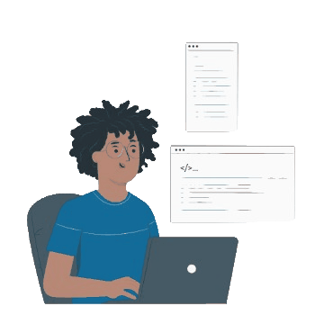

  

  
  

## 👋 Hello, I’m Daniel Felipe

- 🎓 CS Student at the University of Houston  
- 💻 Building full-stack apps and solving real-world problems  
- 🎯 Passionate about web dev, systems, and AI  

---

### Tech Stack  

#### **Languages**  

#### **Frameworks & Libraries**  

---

## About Me:
* Currently a Computer Science student at the University of Houston with a minor in Mathematics  
* Software Development Engineer with experience in full-stack development  
* In constant pursuit of knowledge, both in technological craftsmanship and the human experience  
* **Software Development Engineer** at Anglez (Startup)  
* **Computer Science Student** at University of Houston  

---

## Past Experiences:
* **Web Development Intern** at COGOP International Office  
* **Python Certification** from HackerRank  

---

## Projects:
* **AI Media Summarizer** – A full-stack application that transcribes and summarizes YouTube videos and media files  
* **FullStack Admin Dashboard** – A MERN stack admin panel with advanced data visualization  
* **FullStack Expense Tracker** – A financial tracking application with dynamic insights  

---

## How to reach me / Links:
* 📧 [dbfelipe24@gmail.com](mailto:dbfelipe24@gmail.com)  
* 🔗 [LinkedIn](https://www.linkedin.com/in/daniel-b-felipe)  

<!---
dbfelipe/dbfelipe is a ✨ special ✨ repository because its `README.md` (this file) appears on your GitHub profile.
You can click the Preview link to take a look at your changes.
--->
